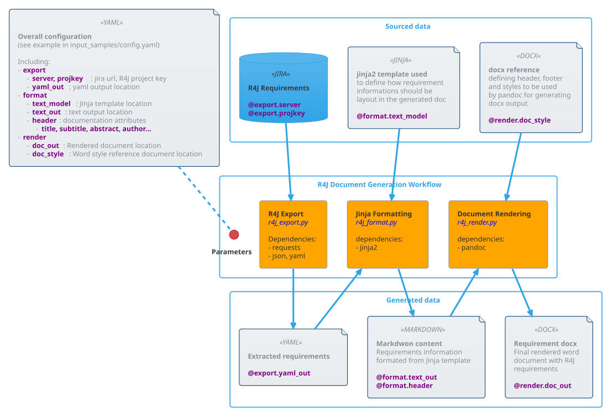

# Purpose

Depending final stakeholders, many different documentation styles and contents can be needed from the same R4J requirement project (e.g. internal confluence page requirement review, internal requirement checklist, external docucmention for 3rd party or customer...). R4J Tools provides a generic workflow based on few operations allowing to export R4J requirements and publish them in multiple publishing format.

Picture below summarizes how R4J document generation workflow can be used to generate a project specific style based Word documentation of R4J requirements.



3 following main operations are proposed in the R4J Tools worklfow:
1. **R4J Export**: This operation consists of extracting R4J requirements from the JIRA database and convert them in YAML form
2. **Jinja Formatting**: This operation consists of parsing R4J requirement format and created a structured document file based on a defined [Jinja template](https://jinja.palletsprojects.com/en/2.11.x/templates/) (Although usage of [Markdown](https://daringfireball.net/projects/markdown/) Jinja template is descibed here, other template desetination format could be defined/used)
3. **Document Rendering**: This operation consists of formatting structured documentation format in a final publication format (Althoug usage of Microsoft Word format is described here, other publication format could be used too)

A global workflow configuration has to be setup to configure inputs/outputs of each operations. following input/output informations:
* Inputs
  * R4J information (including url, project key)
  * Jinja model to be used
  * Word reference document file name and location
* Outputs
  * YAML output file name and location
  * StructureText/Markdwon output file name and location
  * Final Word documentation location 

A configuration file sample is provided in [company-config.yaml](input_samples/company-config.yaml).

# Usage
## Installation pre-requisites
Python scripts used in R4J workflow have dependencies with several python package.
Prior to used this scripts for the first time, following command can be used to ensure that needed packages are installed:

```shell
pip install -r requirements.txt
```
[Pandoc](https://pandoc.org/installing.html) tools need also to be properly installed.

## Project setup
For each project where a requirement document type has to be generated, a dedicated configuration file as to be created. A copy of [company-config.yaml](input_samples/company-config.yaml) can be used and updated accordingly.
In case multiple configurations are needed (e.g. multiple requirement database for same project, multiple format,...), each configuration file should be named approrprielty.

## R4J Export
This operation extracts the requirements and their attributes from a R4J project and converts them in a dedicated YAML formatted file.
[r4j_export.py](./r4j_export.py) python script is used for this operation.

```
usage: r4j_export.py [-h] [-c, --config CONFIG] [-u USER] [-p PASSWORD] [-o OUTPUT]

programm_description

optional arguments:
  -h, --help            show this help message and exit
  -c, --config CONFIG   Configuration file. By default config.yaml file is used
  -u USER, --user USER  Username to access JIRA. If not provided, it will have to be entered in terminal.
  -p PASSWORD, --password PASSWORD
                        Password to access JIRA. If not provided, it will have to be entered in the terminal.
  -o OUTPUT, --output OUTPUT
                        Output file name location to store yaml exported content. This will override value define in configuration file
```

_Dependencies:_
* json
* yaml
* markdownify

## Jinja Formatting
This operation parses YAML formated requirement informations from previous operation and reorganizes them in a structured text file format based on specific Jinja template.
[r4j_format.py](./r4j_format.py) python script is used for this operation.

```
usage: r4j_format.py [-h] [-c CONFIG]

Format R4J YAML requirements in a structure text format accroding specific Jinja template

optional arguments:
  -h, --help            show this help message and exit
  -c CONFIG, --config CONFIG
                        Configuration file
```

_Dependencies:_
* yaml
* jinja2

## Document Rendering
This operation converts structured text file from previous operation in a final rendered documentation (e.g. MS Word) that can be share outside
[r4j_render.py](./r4j_render.py) python script is used for this operation.

```
usage: r4j_render.py [-h] [-c CONFIG]

Render a final document from text file structured requirements description and style reference document (i.e. Word styles, front page, page header/footer, ...)

optional arguments:
  -h, --help            show this help message and exit
  -c CONFIG, --config CONFIG
                        Configuration file
```

_Dependencies:_
* pandoc

## TODO
Features not yet avaiable that would be nice to have:

- Filter requirements extracted from project (currently all the requirements are extracted)
- Configure R4J requirement fields that are exported. Currently only `key`,`summary`,`description` and `updated` fields are exported
- Handle Graphic/Table attachements. Such assets should be merged properly with the requirement descirption in the generated documentation
- Allow to specify multiple authors in the config file. Only one single author can be set currently
- Allow to change format of requirement description exported (currently jira to markdown conversion is done)
- Allow to aggregate "intro" page in the final doc 